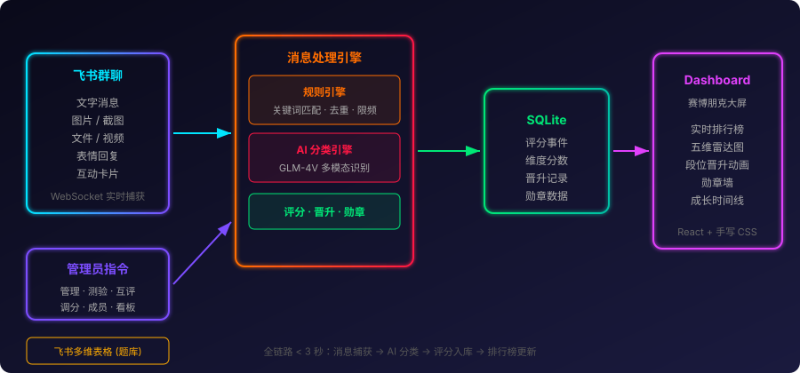
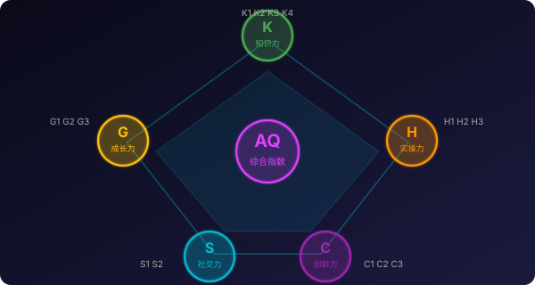
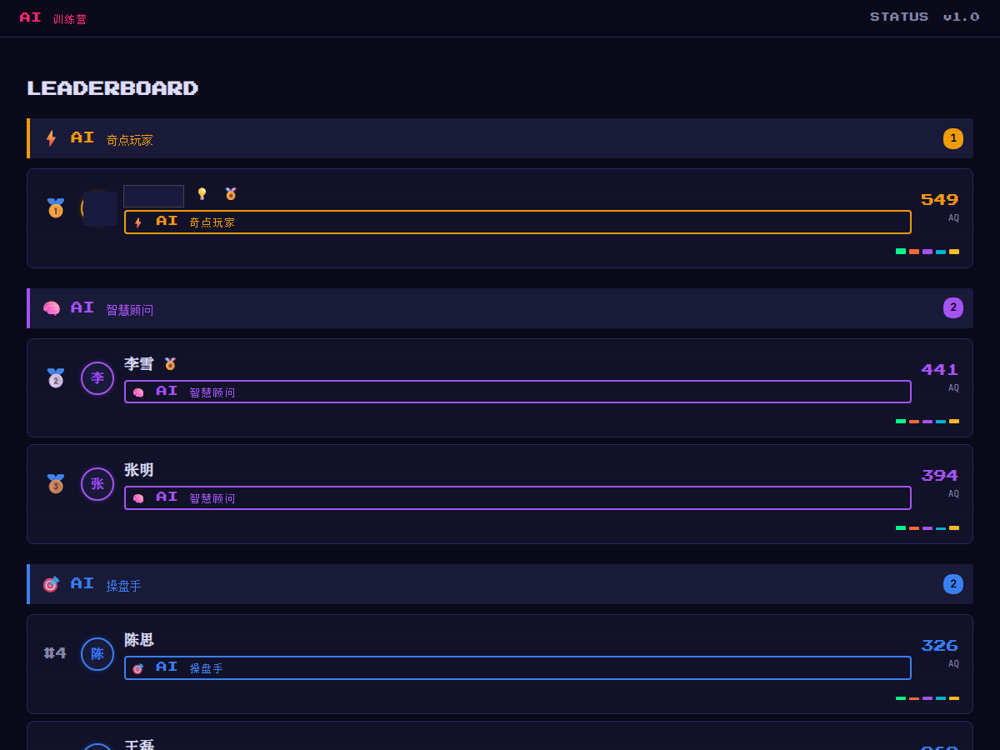
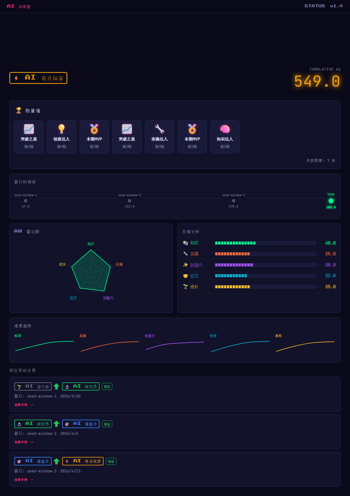

<div align="center">

[English](README.md) | **中文**

# AI Seed Project - 飞书机器人 AI 培训评估系统

面向 AI 训练营、企业培训和学习社群的 TypeScript 自托管系统：用飞书群聊消息、图片、文件、测验卡片和表情互动作为学习行为证据，结合 LLM 辅助评分、管理员审核和游戏化排行榜看板。

[](https://www.typescriptlang.org/)
[](https://fastify.dev/)
[](https://react.dev/)
[](https://sqlite.org/)
[](LICENSE)

**开始使用：** [Quick Start](#quick-start) | [飞书配置](docs/feishu-setup.md) | [管理员手册](docs/admin-guide.md) | [评分规则](docs/student-rules-guide.md)

</div>

**搜索意图：** 飞书机器人、AI 培训评分、培训评估系统、多模态评分、LLM 评分规则、游戏化学习看板、训练营排行榜。

> **边界：** 本项目是自托管工程模板，需要自建飞书应用、飞书群/Base 配置和 OpenAI-compatible LLM 服务；接入真实学员数据前，请自行完成权限、隐私、数据留存和合规审查。

---

## 培训行业的痛点

企业每年在培训上投入巨额预算，但培训效果评估始终是一道未解的难题。

| 痛点 | 现状 | 后果 |
|:---:|:---:|:---:|
| 评估滞后 | 结营后才统计 | 错过干预窗口 |
| 维度单一 | 只看签到和考试 | 忽视过程表现 |
| 人工成本高 | 助教全程记录 | 疲惫且遗漏 |
| 学员无感 | 不知道自己表现如何 | 缺乏参与动力 |
| 数据孤岛 | 散落在各平台 | 无法沉淀复用 |

> *我们需要的不是另一个打卡工具，而是一个真正理解「学习行为」的智能系统。*

---

## 解决方案：群聊即课堂，发言即评分

一套 **「零摩擦、全自动、AI 驱动」** 的培训评估系统。

学员无需安装任何应用、无需学习任何操作——**在飞书群里自然交流，系统自动捕获一切，AI 实时评分，大屏即时呈现。**

<div align="center">



</div>

---

## 核心功能

### 1. 全域感知：AI 无声记录一切

系统像一位不知疲倦的「超级助教」，7x24 小时在群里默默工作。每一条消息、每一张图片、每一个文件、每一次互动——**全部自动捕获，零遗漏。**

```
学员发了一张 PPT 截图
    ↓
系统自动识别：这是一份「学习成果展示」
    ↓
归入「成果展示」维度，+8 分
    ↓
排行榜实时更新 ← 整个过程 < 3 秒
```

### 2. 五维评分模型：15 项精细指标

<div align="center">



</div>

| 维度 | 代号 | 评分项 | 说明 |
|:---:|:---:|:---|:---|
| **知识力** | K | K1 每日签到、K2 随堂测验、K3 知识总结、K4 AI 纠错 | 学了多少、理解了多少 |
| **实操力** | H | H1 作业提交、H2 实操截图、H3 视频打卡 | 有没有动手做、交作业 |
| **创新力** | C | C1 创意分享、C2 点赞互动、C3 深度创作 | 有没有创意和新想法 |
| **社交力** | S | S1 群消息互动、S2 互评贡献 | 活不活跃、有没有帮助别人 |
| **成长力** | G | G1 视频学习、G2 课外资源分享、G3 持续活跃 | 有没有反思进步、分享资源 |

### 3. AI Boot v3：语义评分 + 低干扰运营

**语义评分**：从关键词白名单升级为 LLM 语义理解。一条消息进入后，AI 会结合文本、图片理解结果和文件摘要判断贡献类型，覆盖日常参与、AI 产物、实践复盘、方法分享、资源推荐、同伴帮助和正式任务等场景。

- `qwen3.5-flash` 驱动文本评分、图片理解和助教问答，统一走 OpenAI-compatible 接口
- 图片先做异步理解并写入缓存，后续评分只读取图片描述，避免群聊回复被大图识别阻塞
- 图片-only 消息支持后台补评和重启恢复；真实群消息回放会等待异步任务完成后再关闭数据库
- AI Boot v3 支持 `v3_shadow` 旁路运行：真实落库、可审核、可回放，但不直接改动现有榜单分数

**主动夸赞 Bot**：Bot 不再被动等待 @ 提问。当检测到学员的精彩分享（总分 ≥ 3 分），可在群里主动发表短而具体的鼓励。生产环境可通过开关控制频率，默认先少而准，避免打扰群聊：

```
@杨斌 这份 AI 流程把业务痛点拿捏住了，落地感直接拉满 🔥
@王静Effie 海报审美和 prompt 思路都在线，这波创作有点封神 👏
```

> 夸赞话术采用「小红书/抖音评论区」风格，要求短、具体、有网感，避免反复使用“这个问题问得很好”“欢迎其他同学”等固定套话。

**群聊上下文助教**：奇点小助教被 @ 后会结合最近群聊和文件回答问题。当前边界为最近 10 条群聊上下文 + 最近 2 份文件，适合低频训练营群聊；评分撤回、不要加分、管理/审核/调分等运营意图会优先走专门路由，避免误入闲聊回复。

**每周排行榜结算**：每周四 12:00 自动在群内发布排行榜报告——前三名（🥇🥈🥉 含表彰话术）和后三名（📌 含鼓励话术），由 systemd timer 驱动。

### 4. 赛博朋克实时大屏

纯手写 CSS 赛博朋克主题，适配飞书群 Tab 页签直接嵌入。

**视觉风格：** 霓虹辉光 / 深色背景 / 数据粒子流 / 科幻 HUD 界面

<div align="center">

**实时排行榜 —— 按段位分组，名次变动一目了然**



**个人详情页 —— 勋章墙 + 雷达图 + 五维分析 + 成长时间线**



</div>

### 5. 五级成长体系

| Level | 称号 | AQ 门槛 | 含义 |
|:-----:|:----:|:------:|:-----|
| 1 | 🌱 **AI 潜力股** | 0+ | 刚刚入营，一切皆有可能 |
| 2 | 🔬 **AI 研究员** | 32+ 或满足 Lv2 多路径 | 开始深入思考，展现专业素养 |
| 3 | 🎯 **AI 操盘手** | 64+ | 学以致用，成果显著 |
| 4 | 🧠 **AI 智慧顾问** | 128+ | 影响他人，成为团队智囊 |
| 5 | ⚡ **AI 奇点玩家** | 224+ | 全维度卓越，突破认知边界 |

升级不再依赖结算周期，达到条件即可连续晋升。Lv2 额外支持多路径判断：有 C/S/G 信号的 24+ 分、强实践路径 32+ 分、多维活跃路径 20+ 分都可触发晋升，避免只靠签到和视频分堆出来的“空心晋升”。

### 6. 零代码管理：群聊关键词即指令

培训师不需要懂技术。所有管理操作通过群聊关键词完成：

```
管理 / 管理面板 / 控制面板   → 管理员控制面板（开期、开窗口、毕业结算）
测验 / 随堂测验 / 考试      → 从飞书多维表格题库抽题，发送互动答题卡片
互评 / 互评投票 / 投票      → 学员互评投票卡片，自动计算社交力得分
看板 / 排行 / 排行榜        → 战绩天梯榜卡片，一键跳转 Web Dashboard
调分 / 手动调分             → 运营手动调分卡片（可绕过自动评分上限）
成员 / 成员管理             → 成员角色管理卡片（隐藏排行/更改角色）
```

题库通过飞书多维表格管理，直接在表格里增删改查，系统自动同步。

### 7. 防刷机制

- **每期上限** —— 每个评分项每期有独立分数上限，防止刷分
- **幂等去重** —— 同一消息不会重复计分
- **AI 质量判定** —— 评分必须给出贡献类型、证据、置信度和原因
- **管理员审核队列** —— AI 评分结果推送审核卡片，一键批准/驳回
- **Shadow 安全阀** —— v3 评分可先真实落库观察，不直接影响榜单
- **运营纠错意图** —— “不用加分 / 撤回加分 / 纯瞎聊”等消息不会进入开放闲聊
- **运营手动调分** —— 管理员可绕过自动上限进行手动修正

---

## 项目亮点

| | 亮点 | 说明 |
|:--:|:----:|:-----|
| 🎯 | **零摩擦** | 学员无需学习任何工具，群聊即评估 |
| 🤖 | **AI 驱动** | 大模型多模态理解，超越关键词时代 |
| ⚡ | **实时反馈** | 3 秒内评分上榜，即时正向激励 |
| 🎮 | **游戏化** | 五级成长体系 + 勋章 + 排行榜 |
| 📊 | **多维度** | 5 大维度 15 项指标，全面画像 |
| 🔧 | **零代码** | 群聊指令 + 表格管理，培训师即管理员 |
| 🛡️ | **防作弊** | 限频 + 去重 + AI 质检，保障公平 |
| 📦 | **轻部署** | 单机 SQLite + systemd，10 分钟上线 |

---

## 使用场景

| 场景 | 说明 |
|------|------|
| **企业 AI 培训营** | 零助教投入，全程自动化，实时数据可视化 |
| **新员工入职培训** | 自动追踪参与深度，生成个人成长报告 |
| **产品经理训练营** | 五维模型对应产品能力画像，雷达图一目了然 |
| **读书会 / 学习社群** | 游戏化等级体系持续激励，保持长期活跃 |
| **黑客马拉松** | 实时大屏 + 团队维度评分，比赛氛围拉满 |

---

## 技术扩展方向

系统采用模块化架构，以下方向具备低成本扩展能力：

| 数据层 | IM 适配层 | AI 能力增强 |
|--------|----------|------------|
| 多群联动 | 企业微信适配 | AI 个性化学习建议 |
| 跨营期数据对比 | 钉钉适配 | 自适应难度题库 |
| 数据导出报表 | Webhook 集成 | 智能分组匹配 |
| 学员画像沉淀 | 移动端 H5 适配 | 培训 ROI 量化分析 |

---

## Tech Stack

```
Frontend:   React 18 + TypeScript + Vite (手写 CSS，赛博朋克主题)
Backend:    Fastify + TypeScript (Node.js)
Database:   SQLite (better-sqlite3, WAL 模式)
IM:         飞书开放平台 SDK (WebSocket 长连接)
AI:         Qwen3.5 Flash / OpenAI-compatible LLM (文本评分、视觉理解、助教问答)
Schedule:   systemd timer (每周四 12:00 排行榜结算)
Deploy:     systemd + Nginx + Let's Encrypt，单机即可运行
```

---

## Quick Start

### 1. Clone & Install

```bash
git clone https://github.com/Ethan-YoungQ/ai-seed-project.git
cd ai-seed-project
npm install
```

### 2. Configure

```bash
cp .env.example .env
```

编辑 `.env` 文件，填入：

| 变量 | 说明 |
|------|------|
| `FEISHU_APP_ID` | 飞书自建应用 App ID |
| `FEISHU_APP_SECRET` | 飞书自建应用 App Secret |
| `FEISHU_BOT_CHAT_ID` | 机器人所在群聊的 chat_id |
| `LLM_PROVIDER` | LLM 提供方（推荐 `aliyun`，兼容 OpenAI-style Chat API） |
| `LLM_API_KEY` | LLM API Key |
| `LLM_TEXT_MODEL` | 文本评分/助教问答模型（线上推荐 `qwen3.5-flash`） |
| `LLM_VISION_MODEL` | 图片理解模型（线上推荐 `qwen3.5-flash`） |
| `AI_BOOT_ENGINE_MODE` | AI Boot 引擎模式：`legacy` / `v3_shadow` / `v3_live` |

完整环境变量说明见 `.env.example`。

### 3. Create Feishu Bot

1. 前往 [飞书开放平台](https://open.feishu.cn/) 创建自建应用
2. 开启**机器人**能力
3. 添加权限：`im:message:receive`、`im:chat`、`im:message:send`
4. 设置事件订阅：`im.message.receive_v1`
5. 选择**长连接模式**（推荐）

详细步骤见 [docs/feishu-setup.md](docs/feishu-setup.md)。

### 4. Run

```bash
# Development
npm run dev

# Production build
npm run build
node dist/main.js

# Run tests
npm test

# Replay existing Feishu group messages in dry-run mode
npm run ai-boot:replay-feishu-messages -- \
  --messages /tmp/feishu-messages.json \
  --database-url ./data/app.db \
  --camp-id default \
  --chat-id oc_xxx
```

### 5. Open Dashboard

浏览器打开 `http://localhost:3000/dashboard`

---

## Project Structure

```
ai-seed-project/
├── src/
│   ├── domain/v2/          # 评分领域模型 (ingestor, settler, levels, promotion-announcer)
│   ├── routes/v2/          # API 路由 (board, ranking, member detail)
│   ├── services/feishu/    # 飞书集成 (bot, cards, message handling, AI Boot v3, promotion announcement)
│   ├── storage/            # SQLite repository
│   └── config/             # 配置与默认值
├── apps/dashboard/         # React Dashboard (Vite)
│   ├── src/components/     # UI 组件 (赛博朋克主题)
│   ├── src/hooks/          # 数据 hooks (useRanking, useMemberDetail)
│   ├── src/lib/            # 工具函数 (badge-engine, colors, api)
│   └── src/routes/         # 页面路由
├── tests/                  # Vitest 测试套件
├── scripts/                # 运维与部署脚本
│   ├── ops/deploy-app.sh   # 应用部署
│   ├── ops/deploy-timer.sh # 定时器部署
│   └── ops/backup-db.sh    # 数据库备份
├── deploy/systemd/         # systemd 单元
│   ├── ai-seed-project.service  # 主服务
│   ├── weekly-ranking.service   # 排行榜脚本服务
│   └── weekly-ranking.timer     # 每周四 12:00 定时器
├── docs/
│   ├── admin-guide.md      # 管理员操作手册（零技术背景适用）
│   ├── student-rules-guide.md  # 学员评分/晋升/勋章规则
│   ├── feishu-setup.md     # 飞书应用配置详细步骤
│   └── project-pitch.md    # 项目介绍与使用场景
└── .env.example            # 完整环境变量模板
```

---

## Deployment

### Minimum Requirements

- Node.js 18+
- 1 Core / 1 GB RAM
- 飞书企业版（开放平台权限）
- 阿里云百炼或其他 OpenAI-compatible LLM API 账号

### Production

```bash
npm install
npm run build

# Using systemd (推荐)
sudo cp deploy/ai-seed-project.service /etc/systemd/system/
sudo systemctl enable ai-seed-project
sudo systemctl start ai-seed-project

# 或直接运行
node dist/main.js
```

---

## API Endpoints

| Method | Path | Description |
|--------|------|-------------|
| GET | `/api/health` | 健康检查 |
| GET | `/api/v2/board/ranking` | 排行榜数据 |
| GET | `/api/v2/board/member/:id` | 学员详情 |
| GET | `/dashboard` | Dashboard SPA |

---

## Customization

本项目设计为**模板化可复用**：

1. **替换 IM 平台**：修改 `src/services/feishu/` 适配其他 IM（企业微信、钉钉等）
2. **替换 AI 引擎**：修改 `src/services/llm/provider-config.ts` 和 `src/services/v2/llm-scoring-client.ts` 接入其他 OpenAI-compatible LLM
3. **自定义评分维度**：修改 `src/domain/v2/` 中的评分规则和维度定义
4. **自定义 Dashboard 主题**：修改 `apps/dashboard/src/` 中的 CSS 变量

---

## Documentation

| Doc | Description |
|-----|-------------|
| [Admin Guide](docs/admin-guide.md) | 管理员操作手册（零技术背景适用） |
| [Student Rules](docs/student-rules-guide.md) | 学员评分/晋升/勋章规则说明 |
| [Feishu Setup](docs/feishu-setup.md) | 飞书应用配置详细步骤 |
| [Project Pitch](docs/project-pitch.md) | 项目介绍与使用场景 |
| [.env.example](.env.example) | 完整环境变量说明 |

---

## Contributing

欢迎提交 Issue 和 Pull Request！

1. Fork 本仓库
2. 创建特性分支 (`git checkout -b feature/amazing-feature`)
3. 提交更改 (`git commit -m 'feat: add amazing feature'`)
4. 推送分支 (`git push origin feature/amazing-feature`)
5. 发起 Pull Request

---

## License

[MIT](LICENSE)

---

<div align="center">

**让培训不再是一场独角戏。**

**让 AI 看见每一个人的努力，让数据讲述每一段成长的故事。**

---

*AI Training Camp Evaluation System*
*Powered by Feishu Bot + Qwen3.5 Flash + Gamification*

</div>
